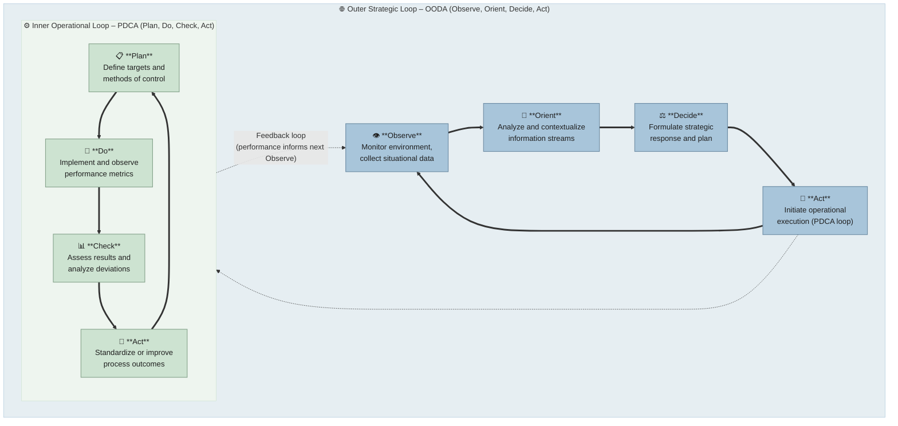

# 👋 Hi, I’m Quang Cuong Huynh

*"Building systems that are fast, secure, compliant, and scalable — where DevOps meets backend innovation."*

---

## 🌐 **Pesuiting Professional**

---
## 🌟 About Me

 - I am Quang Cuong Huynh, an *Investigative–Conventional* professional passionate about turning complexity into clarity and resilience in technology. With a solid foundation in ***System Operation	modified:   README.md***, ***Cloud & DevOps***, ***QA & Compliance***, I design systems that are **scalable**, **secure**, and **audit**-ready by default, bridging governance, innovation, and operational excellence.

 - Primary Goal: Advance as a Cloud & DevOps professional with integrated security and compliance awareness, delivering systems that are resilient, efficient, and enterprise-ready.

### Self Assign Pathway

 - Short-term: DevOps, CloudOps, Administrator.
    + (AZ-900, SC-900, AZ-104, RHCSA, Comptia CLoud+, Network+ or similar)

 - Mid-term: DevOps Engineer, Cloud Security Engineer.
    + (AWS SAA/SysOps, Comptia Sec+, SSCP, CKA, CKS or equivalent)

 - Long-term: Cloud Architect, Security Architect.
    + (CCSP, AZ-500, AWS Certified Security or equivalent)
---

## 📜 **Personal Manifesto**
  * I believe in **clarity**, **integrity**, and **resilience** as the foundations of every digital system. My drive is to analyze, design, and secure complex **architectures—transforming** fragmented processes into **structured, compliant, and scalable ecosystems**. I thrive on uncovering patterns, establishing structure, and building systems that empower people while withstanding change.
 * I commit to building **cloud-native, automated, and secure systems** that scale with business needs, protect data, and empower teams to deliver with confidence.

---

## 🧩 Full Software Development Lifecycle (SDLC) & Agile + CI/CD Expertise

I structure my work around the **end-to-end software development lifecycle**, aligned with Agile and DevOps practices:

### 1️⃣ **Planning & Requirements**
- Conduct **system analysis** and requirement gathering in Agile sprints  
- Translate business needs into **technical architecture designs**  
- Ensure security, compliance, and scalability are considered from the start  

### 2️⃣ **Design & Architecture**
- Design **microservices, 3-tier backend architectures, and RESTful APIs**  
- Define **cloud infrastructure blueprints** (AWS, GCP, Azure) with **IaC (Terraform, Ansible)**  
- Integrate **security-by-design principles** and policy-as-code workflows  

### 3️⃣ **Development**
- Backend: Node.js (Express), Python (Flask, FastAPI)  
- Database: PostgreSQL, MongoDB, Redis  
- Write **unit and integration tests** to ensure code quality and maintainability  

### 4️⃣ **CI/CD & Automation**
- Build and maintain **full CI/CD pipelines** using GitHub Actions, Jenkins, and GitLab CI  
- Containerization and orchestration with **Docker & Kubernetes**  
- Automate deployments and rollback strategies across multi-environment pipelines  

### 5️⃣ **Testing & Quality Assurance**
- Automated testing frameworks: Selenium, PyTest, Postman  
- Conduct **static and dynamic code analysis (SAST/DAST)**  
- Integrate QA pipelines into CI/CD for continuous quality checks  

### 6️⃣ **Deployment & Cloud Operations**
- Deploy and manage cloud-native applications in **AWS, GCP, Azure**  
- Implement **monitoring, logging, and observability** with Prometheus, Grafana, ELK  
- Manage **system reliability, scaling, and security compliance** in production environments  

### 7️⃣ **Maintenance & Continuous Improvement**
- Conduct **incident response, root-cause analysis, and remediation**  
- Continuously improve pipelines and infrastructure for speed, security, and resilience  
- Maintain compliance with OWASP, ISO 27001, and other security standards  

---
## 🛠️ **Core Skills & Tools**

## 💻 Core Skills & Tools (Comprehensive)

| Lifecycle Stage          | Skills & Tools |
|--------------------------|----------------|
| Planning & Design        | System Analysis, Requirement Gathering, Cloud Architecture, Security & Compliance Planning, [Agile](https://www.agilealliance.org/agile101/), [Kanban](https://www.atlassian.com/agile/kanban), [Scrumban](https://www.atlassian.com/agile/scrumban), [Business Analysis](https://img.shields.io/badge/Business_Analysis-Requirements-blue?style=for-the-badge&logo=lucidchart&logoColor=white), [Database Design](https://img.shields.io/badge/Database_Design-Architecture-orange?style=for-the-badge&logo=postgresql&logoColor=white) |
| Development              | Node.js, Express, Python, Flask, FastAPI, REST APIs, PostgreSQL, MongoDB, Redis, Unit & Integration Testing, [NoseTest](https://nose.readthedocs.io/), [PyTest](https://docs.pytest.org/), [Behave BDD](https://behave.readthedocs.io/), [Mocha](https://mochajs.org/), [Chai](https://www.chaijs.com/), [Cypress](https://www.cypress.io/) |
| CI/CD & Automation       | GitHub Actions, Docker, Kubernetes, Tekton CD, Compliance Automation |
| QA & Security            | Selenium, Swagger, SonarQube, OWASP, ISO 27001, Policy-as-Code, SAST/DAST |
| Deployment & Cloud Ops   | GCP, Azure, IBM Cloud, Red Hat OpenShift, Prometheus, Grafana, Scaling & Reliability Management |
| Maintenance & Improvement| Incident Response, Root Cause Analysis, Pipeline Optimization, Continuous Security & Compliance Improvement |

---

### 📋 Agile & Project Management
  
  

### 📊 Business Analysis & Database Design
 

### 💻 Development & Backend
 

 
 
 

#### Python Testing
 
  
  

#### Node.js / JavaScript Testing

### ⚙️ CI/CD & DevOps

  
  

### 🔒 QA & Security

)

 
 
  

### ☁️ Cloud Platforms & Deployment
 

 
 
 

---

## 🚀 **Key STAR Projects & Capstone Highlights**

### 1️⃣ DevOps Automation & Multi-Service Deployment
- **Situation:** Manual deployments were slow, error-prone, and caused downtime.  
- **Task:** Automate CI/CD pipelines, containerize microservices, and improve deployment reliability.  
- **Action:** Built robust pipelines with **GitHub Actions & Argo, Tekton**, containerized applications using **Docker**, orchestrated deployments via **Kubernetes**, and integrated **automated testing (TDD/BDD)** for Python and Node.js services.  
- **Result:** Deployment speed ↑ **80%**, uptime ↑ **99.9%**, fully audit-ready **DevSecOps workflow** established, enabling faster, safer releases.

### 2️⃣ Backend Integration & Cloud Orchestration
- **Situation:** Backend services were fragmented, inefficient, and hard to scale.  
- **Task:** Design a unified, cloud-ready backend system with seamless orchestration.  
- **Action:** Developed **REST APIs** with Node.js and Python, structured databases, integrated CI/CD, and deployed multi-module apps with **containerization** and **Kubernetes orchestration**.  
- **Result:** Performance ↑ **40%**, zero-downtime upgrades, improved maintainability, and unified cloud orchestration.

### 3️⃣ Cloud Compliance & Secure DevOps Framework
- **Situation:** Multi-service environments lacked integrated QA, security, and compliance automation.  
- **Task:** Build automated, secure DevOps pipelines with embedded compliance.  
- **Action:** Implemented **policy-as-code workflows**, automated **QA/security scans**, GitOps deployment, and audit-ready **compliance dashboards**.  
- **Result:** Manual audit effort ↓ **90%**, release frequency ↑ **3×**, full compliance achieved, and system observability improved.

### 4️⃣ Quality Assurance & Industrial Compliance
- **Situation/Task:** Supported QA and regulatory compliance in an industrial manufacturing environment.  
- **Action:**  
  - Performed product inspections and defect tracking, collaborating closely with engineering teams.  
  - Maintained QA documentation, assisted in **ISO/GRC audits**, and contributed to lifecycle reporting.  
  - Applied structured **root-cause analysis** and recommended preventive measures to reduce recurring issues.  
- **Result:** Reduced recurring defects, improved compliance reporting accuracy, and strengthened **process governance** and incident management.  

---

## 🌟 Personal Project Management & Job Orchestration

**I orchestrate work, projects, and teams with precision, agility, and resilience**, harmonizing rapid decision-making with continuous improvement. My approach integrates **agile situational awareness** and **operational rigor**, guided by a dual-loop philosophy:

**🔄 Dual-Loop Philosophy:**

* **OODA Loop:** Adaptive Decission strategy through Observe → Orient → Decide → Act
* **PDCA Cycle:** Time-boxed period Operational excellence through Plan → Do → Check → Act

---

### 🏛️ Declaration

> “I operate at the intersection of **strategic insight** and **operational mastery**.
> I observe, orient, and decide with clarity and purpose, while continuously refining processes to achieve measurable impact.
> I orchestrate workflows, projects, and systems with precision, agility, and resilience, ensuring that every action informs the next, and every cycle drives sustainable improvement.”

---

### ⚙️ Core Principles

| Principle                         | Focus                                  | Outcome                                       |
| --------------------------------- | -------------------------------------- | --------------------------------------------- |
| **Strategic Agility (OODA)**      | Rapid assimilation & contextualization | Anticipate change and make adaptive decisions |
| **Operational Excellence (PDCA)** | Implement, monitor, refine processes   | Continuous learning & improvement             |
| **Integrated Orchestration**      | Align strategy & execution             | Tactical actions feed long-term vision        |
| **Evidence-Based Adaptation**     | Data-driven reflection                 | Every iteration produces measurable impact    |

---

---

### 🏃‍♂️ Agile & Scrumban Workflow

**Mindset:** Flexible yet structured project delivery for predictable, transparent, and iterative progress.

**Core Practices:**

* **📌 WIP Limits:** Maintain focus, prevent bottlenecks, ensure quality output
* **🗂️ Job Roadmap & Sprint Stories:** Track tasks via Kanban-style boards and sprint stories aligned with roadmap milestones
* **🔄 Continuous Feedback & Iteration:** Regular reviews & retrospectives refine workflows and process efficiency
* **🚀 Incremental Delivery:** Deliver projects in small, testable increments to reduce risk and generate early value

---

### 💡 Personal Motto

> “**Observe, Decide, Act — Refine, Improve, Repeat.**”

---

**Visual Idea for Portfolio Implementation:**

1. **Top Hero Section:** Dual-loop diagram (OODA & PDCA cycles) side by side with your declaration.
2. **Principles Section:** Use a 2×2 icon grid showing each principle with its focus and outcome.
3. **Workflow Section:** Horizontal Kanban-style timeline illustrating WIP limits → roadmap → iteration → incremental delivery.
4. **Motto Section:** Prominently displayed as a banner or highlighted quote.

---

## 🔗 **Connect With Me**
  

### 🏅 Certifications & Badges

---

### 📈 GitHub Activity & Stats

  
  

## AVAILABILITY

Open to full-time entry-level roles, Fresher or trainee programs in IT Support, System Administration, DevOps, SecOps, NOC, or Cloud Operations.
